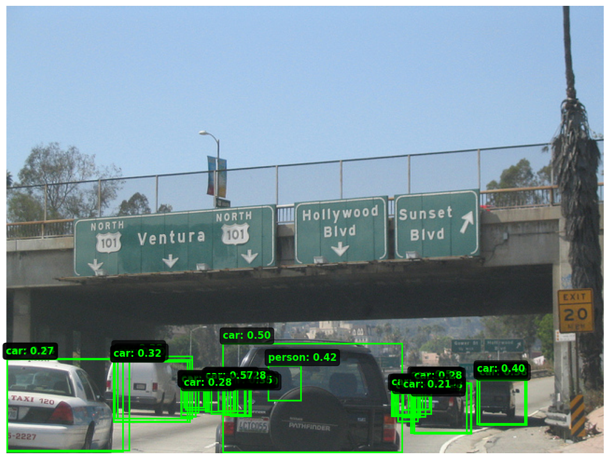
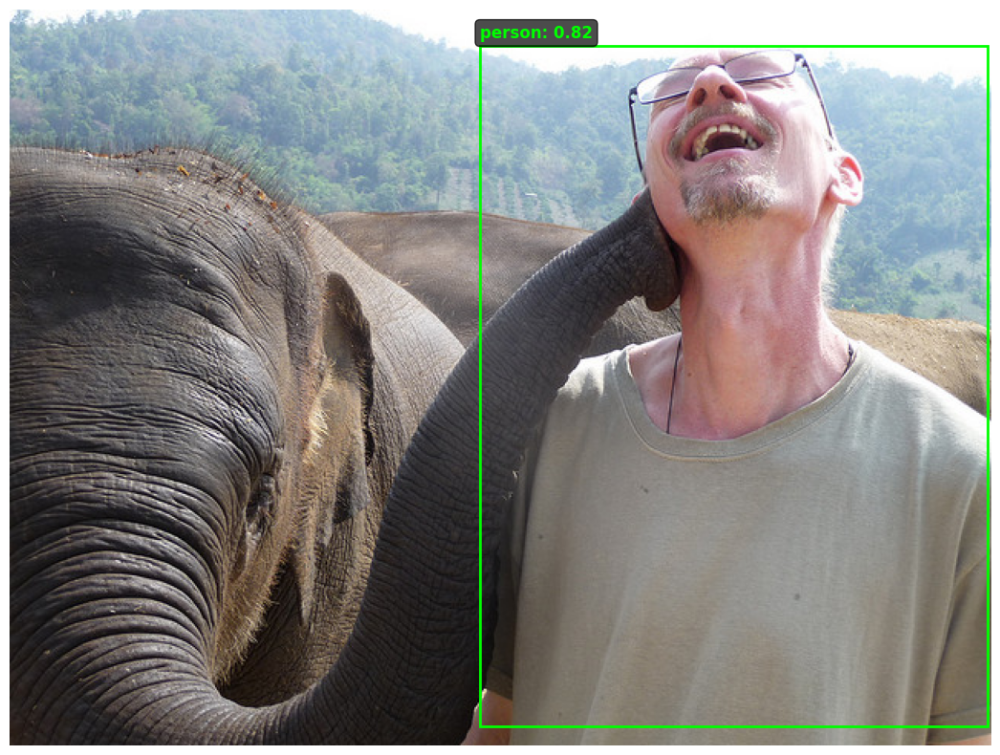
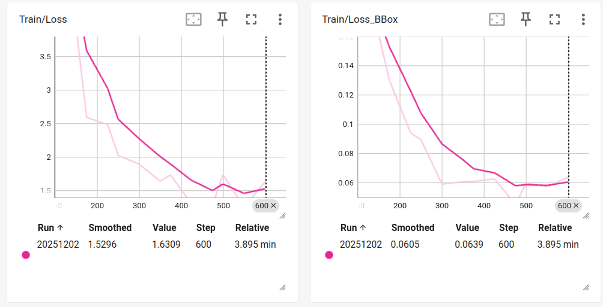
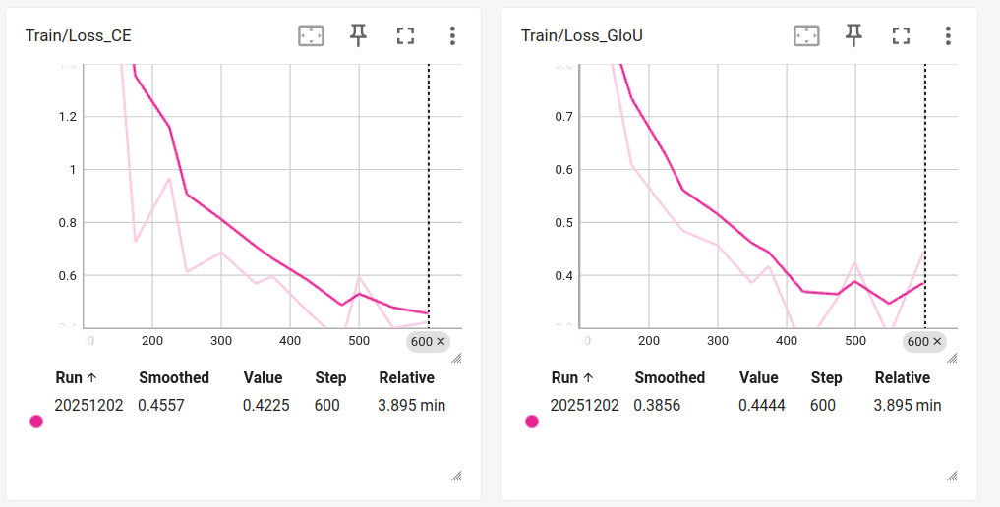
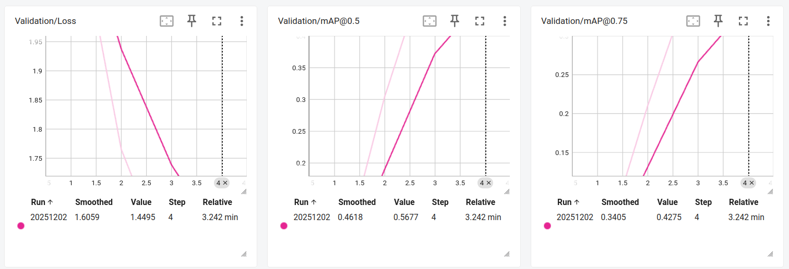

# DETR Object Detection Training

## 

- **`detr.ipynb`**: DETR training notebook with comprehensive documentation
- **`analyze_results.py`**: Post-training analysis script


### 1. Training the Model


The notebook is organized into clear sections:
1. **Configuration & Setup** - Hyperparameters and environment
2. **Dataset Preparation** - COCO subset loading
3. **PyTorch Dataset** - Custom dataset implementation
4. **Model Architecture** - DETR model loading and configuration
5. **Training Utilities** - Metrics, loss functions, error analysis
6. **Training Loop** - Complete training implementation
7. **Execute Training** - Run the training
8. **Inference** - Use trained model
9. **Results Analysis** - TensorBoard and metrics
10. **Summary** - Next steps and resources

### 2. Monitor Training with TensorBoard

```bash
tensorboard --logdir=./runs
```

Then open http://localhost:6006 to view:
- Loss curves (total, classification, bbox, GIoU)
- mAP metrics over epochs
- Prediction visualizations
- Error analysis plots
- PyTorch profiler traces

### 3. Analyze Results

After training completes:

```bash
python3 analyze_results.py
```

This will:
- Print checkpoint summary
- Compare checkpoint performance
- Analyze model size
- Generate visualization plots

### Example

Random Image from Validation Set:





The image shows:
- Detected objects with bounding boxes
- Predicted classes of objects
- The confidence score of the model for each detection


## Training Results


| Metric | Value |
|--------|-------|
| Best Validation Loss | 1.4049 |
| Best mAP@0.5 | 0.5670 |
| Best mAP@0.75 | 0.4304 |
| Training Time | ~8 minutes (V100 GPU) |

**Loss Components (Final Epoch)**:
- Classification Loss: Tracked
- Bbox L1 Loss: Tracked
- GIoU Loss: Tracked






## Key Features

###DETR Architecture
- **Backbone**: ResNet-50 (frozen during fine-tuning)
- **Transformer**: 6 encoder + 6 decoder layers
- **Object Queries**: 100 learnable queries
- **Parameters**: 41.5M total, 18M trainable

### Dataset
- **Classes**: 10 (person, car, dog, cat, bicycle, motorcycle, airplane, bus, train, truck)
- **Train samples**: 2000 images
- **Val samples**: 500 images
- **Source**: COCO 2017

### Training Configuration
- **Batch Size**: 16
- **Learning Rate**: 1e-4 (transformer), 1e-5 (backbone - if unfrozen)
- **Optimizer**: AdamW with weight decay 1e-4
- **Mixed Precision**: Enabled (AMP)
- **Gradient Clipping**: Max norm 0.1

### Viewing the profiler
You can view the profiler logs via chrome://tracing/
